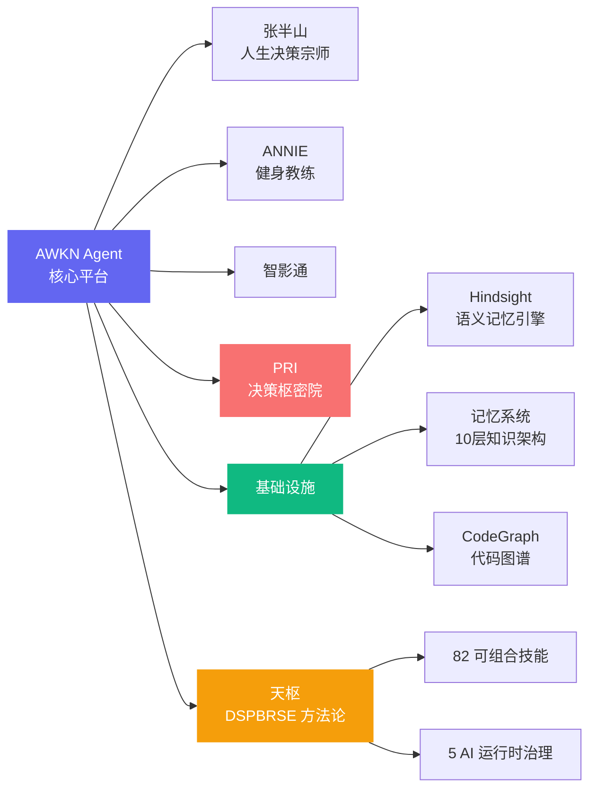

<div align="center">

<!-- ═══ Typing Animation ═══ -->


<!-- ═══ Banner ═══ -->


<!-- ═══ Badges ═══ -->
<p>
  <a href="https://awkn.cn"></a>
  <a href="https://github.com/awkn-lab/tianshu"></a>
  
  
  
  
  
</p>

<!-- ═══ Tech Stack Badges ═══ -->
<p>
  
  
  
  
  
  
  
  
  
</p>

---

</div>

## 🧬 我们是谁

**AWKN = AWAKEN → Awakened Decision Intelligence（觉醒式决策智能）**

AI 的力量不在于替代人类，而在于唤醒每个创造者本就具备的决策潜能。AWKN Lab 是一个专注于 **AI 决策智能** 的开源实验室——我们构建的不是又一个 AI 工具，而是一套让一个人拥有整支团队决策能力的工程方法论。

> **一个人 + AI 工程方法论 = 一支完整团队。**

我们构建了从想法到上线的全流程 AI 工程治理体系 **天枢 · DSPBRSE**——如北斗七星为旅人导航，七个阶段构成完整的工程治理闭环。涵盖 82 个可组合技能、20+ 产品线、5 个 AI 运行时的统一治理框架。所有方法论均来自 500+ 小时真实项目实战，非教科书理论。

### 三条信念

| 信念 | 内涵 |
|:-----|:-----|
| **方法论 > 模型** | 模型会迭代、过时、被替代。但工程方法论——拆解问题、验证假设、管理质量——永不过时。DSPBRSE 与具体模型解耦，工程直觉才是真正的护城河。 |
| **实战 > 理论** | 每条规则可追溯到具体项目、具体失败。清晰度门禁来自 17 次"带病开工"的返工，节奏卡牌来自 23 次 AI 无限循环。不教教科书，沉淀生存手册。 |
| **开源 > 闭源** | 方法论不应锁在某个商业产品的黑箱。DSPBRSE 全流程开源，一套治理核心，五个 AI 运行时共享。 |

---

## ⭐ 天枢 · 北斗七星导航体系

> *斗转星移，枢纽不动。七颗星辰照亮的，是从混沌到秩序的唯一航线。*

北斗七星是人类最古老的导航系统。DSPBRSE 将七个工程阶段映射为七颗星——**天枢为锚**，指引 AI 工程从发现到进化。

```
  ★ 天枢 ── ★ 天璇 ── ★ 天玑 ── ★ 天权 ── ★ 玉衡 ── ★ 开阳 ── ★ 摇光
  Dubhe     Merak     Phecda    Megrez    Alioth    Mizar     Alkaid
  D 发现     S 定义     P 规划     B 构建     R 审核     S 交付     E 进化
  ┃          ┃          ┃          ┃          ┃          ┃          ┃
  枢纽之眼   琢玉成形   运筹帷幄   执权落子   执衡明断   破晓出关   星光永续
```

| 星辰 | DSPBRSE | 治理角色 | 核心技能 | 版本 |
|:----:|:-------:|:---------|:---------|:----:|
| ★ 天枢 | **D** Discover | 枢纽之眼 | PRD 生成 · 用户洞察 · 竞品分析 | v2.1 |
| ★ 天璇 | **S** Specify | 琢玉成形 | 需求冻结 · 验收标准 · Delta Spec | v1.0 |
| ★ 天玑 | **P** Plan | 运筹帷幄 | 方案设计 · 风险评估 · 资源规划 | v2.1 |
| ★ 天权 | **B** Build | 执权落子 | 工程师 · 工程文档 · 执行检查 | v2.8 |
| ★ 玉衡 | **R** Review | 执衡明断 | 代码审核 · 安全扫描 · AI 审核 | v4.1 |
| ★ 开阳 | **S** Ship | 破晓出关 | CI/CD 流水线 · 部署 · 灰度发布 | v2.11 |
| ★ 摇光 | **E** Evolve | 星光永续 | 复盘总结 · 技能进化 · 经验沉淀 | v3.2 |

**五大融合机制**：项目宪法 · Delta Spec 增量规格 · 工程铁律 · 四维质量体系 · 认知框架（清晰度门禁 + 节奏卡牌）

→ 详见 [`tianshu`](https://github.com/awkn-lab/tianshu)

---

## 🧩 开源技能矩阵

### 核心工程技能

| 仓库 | 描述 | 亮点 |
|:-----|:-----|:-----|
| [**tianshu**](https://github.com/awkn-lab/tianshu) | 7 阶段全生命周期方法论引擎 | 清晰度门禁 · 节奏卡牌 · 自进化闭环 |
| [**awkn-engineer**](https://github.com/awkn-lab/awkn-engineer) | Build 阶段唯一执行者 | 8 阶段执行脊 · TDD 强制 · 自愈循环 |
| [**awkn-review**](https://github.com/awkn-lab/awkn-review) | Review 阶段质量守门人 | 125 子技能 · AI 审核 · 供应链安全 |
| [**awkn-execution-check**](https://github.com/awkn-lab/awkn-execution-check) | 变更前 5 步门禁 RLPVV | 爆炸半径评估 · 知识图谱 · 跳步检测 |
| [**awkn-agent-design**](https://github.com/awkn-lab/awkn-agent-design) | Agent 架构设计范式 | 17 模块 · 逆向工程手册 · 黑盒探测 |

### 产品应用工具

| 仓库 | 描述 | 技术栈 |
|:-----|:-----|:-------|
| [**awkn-Feel**](https://github.com/awkn-lab/awkn-Feel) | 情感与情绪感知分析工具 — 从文本/语音/图像提取情绪信号，构建情感图谱 | Python |
| [**life-choice**](https://github.com/awkn-lab/life-choice) | 人生决策宗师 Web 应用 — 东方命理量化为 K 线图谱（7 维 OHLCV） | NestJS + Prisma + React 18 |
| [**solo-skill-booster**](https://github.com/awkn-lab/solo-skill-booster) | SOLO 技能创作赛提分官 — 5 维评审 · 扣分证据 · 三档提分路线 | Markdown SKILL.md |
| [**SOLO-Skill**](https://github.com/awkn-lab/SOLO-Skill) | SOLO 技能创作赛框架 — 技能原子化 · 版本约束 · 质量门控 | Markdown SKILL.md |
| [**subtitle**](https://github.com/awkn-lab/subtitle) | AI 视频字幕处理 — WhisperX × 说话人识别 × 多语言翻译配音 | Python + WhisperX |
| [**god**](https://github.com/10919669/god) | 命运骰子 🎲 — 掷骰做决定。吃饭选择困难？让天意帮你选。 | HTML/CSS/JS |
| [**AWKN-LAB**](https://github.com/awkn-lab/AWKN-LAB) | AWKN 核心团队入口 — 产品线 · 基础设施 · 记忆系统 · 共享资产 | 项目总集 |

---

## 🏗️ 产品矩阵

<div align="center">



</div>

| 产品线 | 定位 | 技术栈 |
|:-------|:-----|:-------|
| **AWKN Agent** | 有工程方法论底色的 AI 智能体 | React 19 + Bun + Electron + SQLite |
| **张半山 · 人生决策宗师** | AI 人生决策顾问（东方命理量化） | NestJS + Prisma + React 18 |
| **ANNIE 健身教练** | AI 健身教练 | Vue.js + MiniMax + ONNX |
| **PRI 决策枢密院** | AI 决策支持系统 | PRD 全流程 · 12 子技能 |
| **Hindsight** | 语义记忆引擎（LongMemEval SOTA） | Python + LanceDB + Docker |
| **记忆系统** | 公司级 AI 记忆层（12 层架构） | Tolaria MCP + 跨运行时治理 |

---

## ⚡ 技术特征

<div align="center">

| 维度 | 指标 |
|:-----|:-----|
| 🧠 AI 运行时 | Claude Code · TRAE CN · QoderWork · Alice · OpenAI Codex |
| 📦 技能总数 | **82** 个 SKILL.md（57 主技能 + 25 子技能） |
| 🔄 自进化引擎 | E1 自诊断 → E2 自动修复 → E3 技能生命周期 → E4 主动学习 → E5 进化门禁 |
| 🛡️ 质量门禁 | 7 闸门 · 156+ 单元测试 · 0 tsc 错误 |
| 🌍 LLM 集成 | DeepSeek · GLM · MiniMax · Moonshot · DashScope · OpenAI · Anthropic · Ollama |
| 📊 实施率 | E1-E5 自进化 152/169 = **90%** |

</div>

---

## 🌱 天枢之道

> **"斗转星移，枢纽不动。上下文 + 目标 + 约束 + 验证 = 稳定的 AI Coding"**
> 
> — 天枢 · DSPBRSE 工程导航 · 源自 500+ 小时实战沉淀

- **天枢之眼**：看清才能行动——四维清晰度门禁，杜绝带病开工
- **摇光之续**：同一错误出现 3 次 → 自动晋升为 learned rule，星光永续
- **只编排不执行**：天枢引擎只负责导航调度，具体能力委托七颗星辰
- **跨运行时统一**：一套星图，五个 AI 运行时共享同一航线

---

## 🚀 快速开始

```bash
# 克隆天枢方法论核心
git clone https://github.com/awkn-lab/tianshu.git

# 安装到你的 AI 编程助手
# Claude Code: 复制到 ~/.claude/skills/tianshu/
# TRAE CN:     复制到 .trae-cn/skills/tianshu/
# Cursor:      复制到 .cursor/skills/tianshu/

# 开始使用 —— 在任何项目中说：
# "帮我做 DSPBRSE 全流程"
# "进入 Build 阶段"
# "执行检查：RLPVV 五步门禁"
```

---

## 📊 活跃度

<div align="center">


<!-- Contribution Snake -->


</div>

---

<div align="center">

<p>
  <a href="https://awkn.cn">🌐 官网</a> · 
  <a href="https://github.com/awkn-lab">📦 开源仓库</a> · 
  <a href="mailto:contact@awkn.cn">📧 联系我们</a>
</p>

<p>
  <sub>Made with ❤️ and AI by AWKN Lab · 一个人 + AI = 一支完整团队</sub>
</p>

</div>
